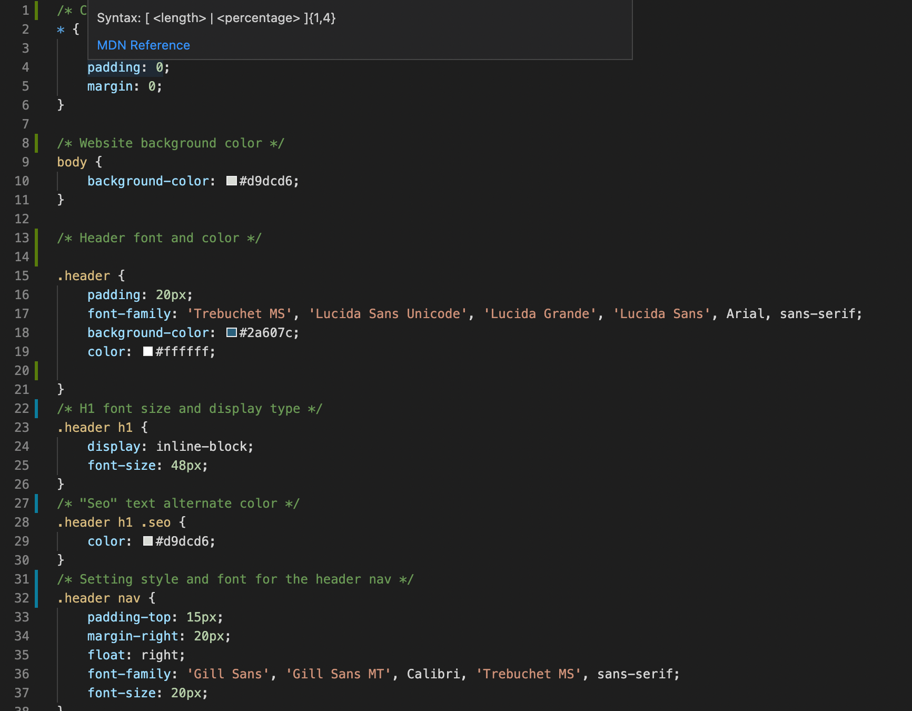
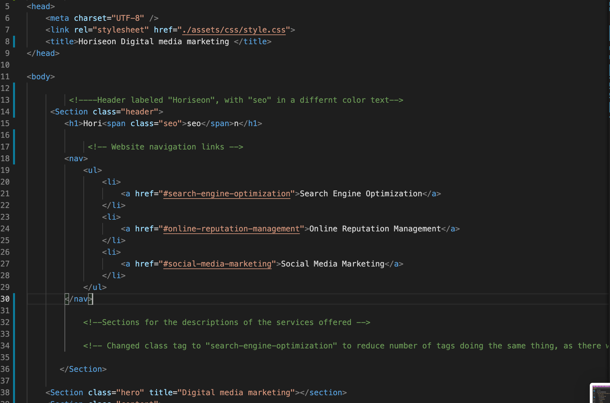

# <Horiseon website refactor>

## Description

My goal for this project was to refactor the code to make it more accessible and optimized for search engines. I accomplished this by clearly commenting the functions of each piece of code as well as replacing non-semantic elements such as Div tags, with semantic elements such as nav, or section.   I cleaned up the CSS by reducing the code that was executing the same processes. All changes I made are labeled along with the functions of each element. 
Throughout this coding experience I learned more about making sites accessible and easier to navigate for users and computers. I also learned about commenting, and the placement of semantic elements and why they are so important. 

## Installation

To edit code, download the index.html, and css stylesheet. Open in your prefered code editor.
If you'd like to add to this code please contact me.
 

## Usage
  
The CSS and HTML of the project:  
  

  

  
A preview of the website as is

  

  

## Credits

Orginal code recieved from John Young at the UW Coding bootcamp

